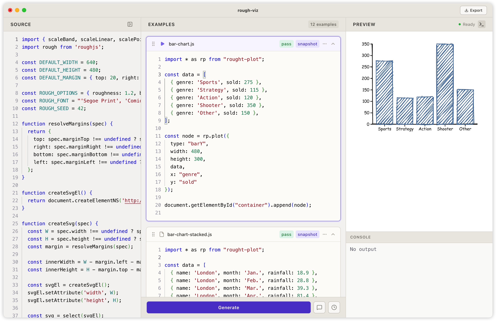

# WIP: Recho Specs

Recho Specs is an AI-native programming interface for building JavaScript libraries from examples. Define your API with usage examples—the AI generates the implementation, runs them in a live preview, validates behavior with snapshot tests, and exports a production-ready npm package with Vitest tests and a docs site. **Examples are the single source of truth.** See the [demo video](https://vimeo.com/1193338956) and a [rough plot library](https://rough-plot.bairui.dev/) built with Recho Specs.

